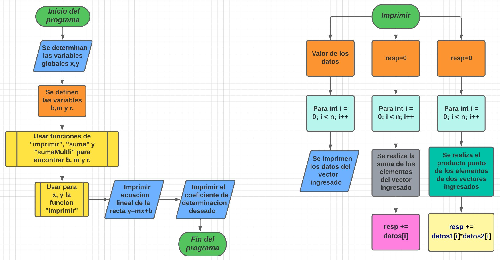
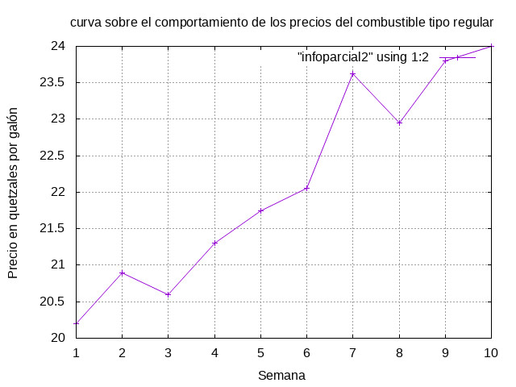
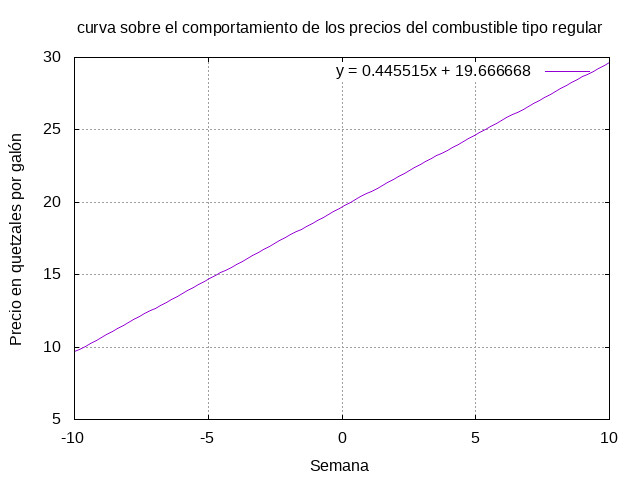
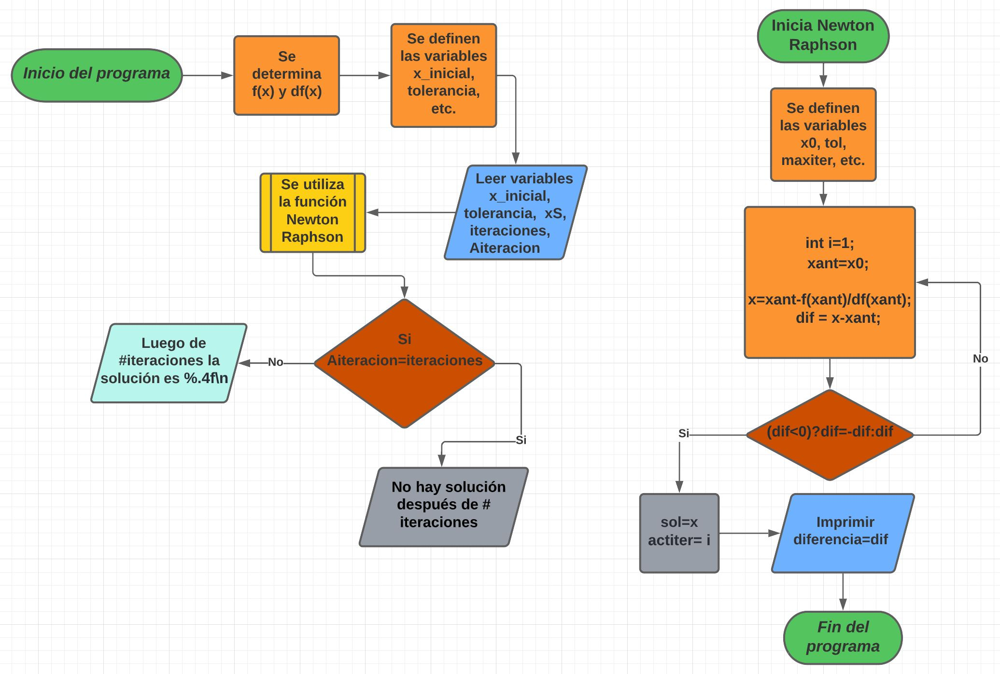
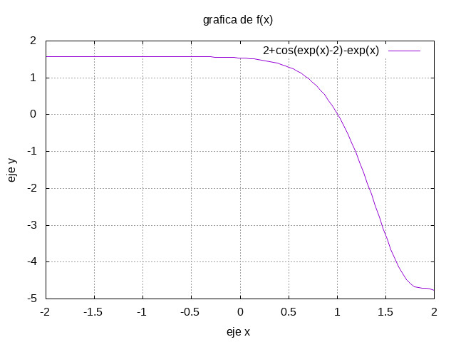

# Segundo parcial (problemas)

Aquí se dejará constancia de la documentación de cada problema como también su respectivo código sobre el parcial 2 del Laboratorio de Simulación.

### Problema 1

**variables de entrada y salida:**

- y = Datos sobre los precios del combustible tipo regular
- x = Semana
- r = Coeficiente de correlacion
- m = Pendiente
- b = Intercepto

**Metodología:**
- Inicia el programa
- Este problema se divide en 3 funciones.
- Se realiza una función que ayuda a imprimir los datos sobre los vectores dados definida como "imprimir".
- Se usa la función "suma" para hacer la suma de los elementos de cada vector dado.
- Se usa también la función "sumaMultli" para hacer el producto punto de los vectores dados.
- Se determinan las variables del problema "r, m y b".
- Se usa la función "imprimir" para que el usuario obtenga la información de cada vector.
- Se encuentra el valor de "b" con la función "suma"
- Se encuentran los valores de "m" y "r" con las funciones "sumaMultli" y "suma"
- Por último con la función "printf" se imprime la ecuación lineal deseada y el coeficiente de determinación.
- Finaliza el programa

**Datos obtenidos:**
- La ecuación lineal compilado el programa es y = 0.445515x + 19.666668
- Se compila el programa y el coeficiente de determinación es de 0.930660.
- Gráfica de los datos



- Gráfica de la ecuación lineal de la recta



- Asumiendo que el gobierno tiene un tope de 30 quetzales por galon, se llegará a ese tope en 23.19 semanas si el precio se mantiene en este comportamiento


**Compilación y ejecución:**
```
 $ gcc -o minimoscuadrados.out minimoscuadrados.c -lm
 $ ./minimoscuadrados.out
 ```

 ### Problema 2
 
**variables de la función principal**
 - f(x) es la función de la que obtenemos las raices.
- df(x) es la derivada de la funcion f(x).
**variables de la función NewtonRaphson**
- x0 es la estimación inicial
- tol es la tolerancia de la aproximación
- maxtiter es la iteració máxima del contador
- *actiter es el contador de la función
- *sol sería la raíz de la función
**variables de la función principal**
- x_inicial se denomina como la variable inicial de la raiz y es una variable de entrada.
- tolerancia se deomina a la tolerancia del error al obtener la raiz y es una variable de entrada.
- iteraciones se denomina al numero maximo de iteraciones y es una variable de entrada.
- Aiteracion se denomina al contador de iteraciones.
- xS es la variable de la solucion despues de las iteraciones.
- f(xant)=f(x) 
- df(xant)=df(x)
- xant=x0
- x es el valor que se obtiene de xant-f(xant)/df(xant)
- dif es la diferencia entre la estimación y el resultado de la iteración.

**Metodología**
- Se inicia el programa 
- Se determina la funcion f(x)
- Se determina la primera derivada df(x)
- Se calcula el valor aproximado inicial "x_inicial"
- Se calcula la tolerancia "tolerancia"
- Se calcula el numero maximo de iteraciones "iteraciones"
- Se usa el contador de iteraciones "Aiteracion" para contar las veces que se repitió el proceso hasta llegar a la iteración ingresada
- Luego se inicializa el método Newton Raphson con las variables x0, tol, maxiter, *actiter y *sol.
- Se imprime la raiz
- Finaliza el programa

**Datos obtenidos**
- Después de dos iteraciones la raiz de la función 2+cos(exp(x)-2)-exp(x) es 1.0076
- Gráfica de la función f(x)




**Compilación y ejecución:**
```
 $ gcc -o newtonraphson.out newtonraphson.c -lm
 $ ./newtonraphson.out
 ```
